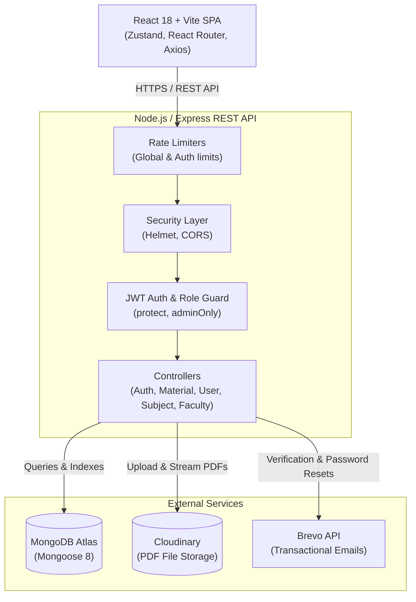

# 🎓 MCA Repository (MCARepo)

[](LICENSE)
[](https://react.dev/)
[](https://vitejs.dev/)
[](https://nodejs.org/)
[](https://expressjs.com/)
[](https://www.mongodb.com/)
[](https://cloudinary.com/)

A modern, production-ready, full-stack academic repository designed specifically for Master of Computer Applications (MCA) students and faculty. **MCARepo** eliminates scattered resources across WhatsApp chats, Telegram groups, and fragmented Google Drive folders by offering a structured, searchable, community-driven platform for exam papers, lecture notes, lab manuals, and student answer scripts.

---

## 📑 Table of Contents

- [Key Highlights](#-key-highlights)
- [System Architecture](#-system-architecture)
- [Tech Stack](#-tech-stack)
- [Core Features](#-core-features)
- [Directory Structure](#-directory-structure)
- [Database Models](#-database-models)
- [API Reference](#-api-reference)
- [Getting Started](#-getting-started)
  - [Prerequisites](#prerequisites)
  - [Local Installation](#local-installation)
  - [Environment Variables](#environment-variables)
  - [Database Seeding](#database-seeding)
  - [Running the Application](#running-the-application)
- [Initial Admin Setup](#-initial-admin-setup)
- [Deployment Overview](#-deployment-overview)
- [Security & Best Practices](#-security--best-practices)
- [License](#-license)

---

## 🌟 Key Highlights

- **Academic Hierarchy**: Organize study materials by **Batch** (e.g., `2024-2026`), **MCA Year** (`1`, `2`, `3`), **Semester** (`1` through `6`), **Section** (`A`, `B`, `Common`), **Subject**, **Faculty**, and **Exam Type**.
- **Exam & Material Taxonomy**: Supports Class Tests (`CT1`, `CT2`), Final Assessment Test (`FAT`), `LabExam`, and `General`, categorized into Question Papers, Answer Scripts, Notes, Lab Records, Reports, and Presentations.
- **In-Browser PDF Viewer**: Embedded PDF rendering via `react-pdf` with authenticated backend streaming proxy.
- **Smart Duplicate Prevention**: Automatic detection prevents redundant file uploads for identical subject, batch, semester, section, and exam categories.
- **Coverage Gaps Matrix**: Interactive heatmap and grid showing missing resources per subject to guide student contributions where they are needed most.
- **Gamified Leaderboard**: Ranks top student contributors based on upload volume, total upvotes, and download impact.
- **Student & Alumni Directory**: Batch-wise searchable networking portal with custom privacy controls (`hidden`, `same_batch`, `all`), career links (LinkedIn, company, role), and contribution stats.
- **GPA / CGPA Calculator**: Built-in 10-point scale semester GPA calculator with dynamic course rows and instant grade point aggregation.
- **Admin Moderation Suite**: Full dashboard for managing flagged materials, inspecting report reasons, dismissing flags, assigning admin roles, and curating course catalogs.

---

## 🏛 System Architecture



---

## 💻 Tech Stack

### Frontend
- **Framework**: [React 18](https://react.dev/) (Vite bundler)
- **Routing**: [React Router v6](https://reactrouter.com/) (protected routes, role guards, public redirects)
- **State Management**: [Zustand](https://github.com/pmndrs/zustand) (minimalist persistent auth and material state)
- **Document Rendering**: [react-pdf](https://projects.wojtekmaj.pl/react-pdf/) + PDF.js worker
- **File Uploads**: [react-dropzone](https://react-dropzone.js.org/) (drag & drop validation)
- **Notifications**: [react-hot-toast](https://react-hot-toast.com/)
- **HTTP Client**: [Axios](https://axios-http.com/) (automatic Bearer token injection interceptors)
- **Styling**: Native modular dark-themed CSS design system with responsive glassmorphism aesthetics

### Backend
- **Runtime**: [Node.js](https://nodejs.org/) (ES Modules)
- **Framework**: [Express 4](https://expressjs.com/)
- **Database**: [MongoDB](https://www.mongodb.com/) with [Mongoose 8](https://mongoosejs.com/)
- **File Handling**: [Multer](https://github.com/expressjs/multer) (in-memory buffer processing)
- **Cloud Storage**: [Cloudinary](https://cloudinary.com/) (secure PDF upload, delivery, and deletion)
- **Email Service**: [Brevo API (Sendinblue)](https://www.brevo.com/) via direct HTTPS endpoints
- **Authentication**: [JSON Web Tokens (JWT)](https://jwt.io/) & [bcryptjs](https://github.com/dcodeIO/bcrypt.js)
- **Security & Logging**: [Helmet](https://helmetjs.github.io/), [CORS](https://github.com/expressjs/cors), [express-rate-limit](https://github.com/express-rate-limit/express-rate-limit), [Morgan](https://github.com/expressjs/morgan)

---

## ✨ Core Features

### 1. Authentication & Student Verification
- User registration requires Name, Roll Number, Batch, Current Year, and Password.
- Automatic verification email sent via Brevo with encrypted cryptographic token.
- Secure token-based password reset workflow.
- Session persistence through signed 7-day JWT tokens.

### 2. File Upload & Processing
- Direct PDF file validation (type check and file size constraints).
- Metadata extraction: Title, Batch, Year, Semester, Section, Subject, Faculty, Exam, Material Type, Description, and Tags.
- Cloudinary integration streams PDF files from memory buffers without writing unmanaged files to local disk.
- Deduplication check prevents re-uploading duplicate materials for identical exams and subjects.

### 3. Search, Discovery & In-Browser Preview
- Compound MongoDB indexing on academic fields (`batch`, `mcaYear`, `semester`, `section`, `subject`, `exam`, `materialType`).
- Full-text search on Title, Subject, Description, and Tags.
- Sorting options: Newest, Oldest, Most Downloaded, Most Upvoted.
- In-browser PDF preview with secure token streaming route (`/api/materials/:id/serve`) and single-click direct attachment downloads.

### 4. Community & Collaboration
- **Upvote & Save**: Upvote high-quality answers and bookmark resources to a personal "Saved Materials" collection.
- **Content Flagging**: Community-driven reporting system for incorrect, unreadable, or duplicate files.
- **Coverage Gaps Analysis**: Real-time aggregation showing which semesters and subjects lack specific test papers or notes.
- **Contribution Leaderboard**: Highlights active contributors, fostering healthy academic peer assistance.
- **Batch & Alumni Directory**: Connect with current peers and graduated alumni; configurable privacy settings allow members to show or hide personal email and LinkedIn handles.
- **GPA Calculator**: Calculate semester grade point averages with credit-weighted calculations.

### 5. Administrative Controls
- Visual metrics overview (total materials, active users, flagged submissions, breakdown by exam/type).
- Moderation inbox: review flagged materials along with specific student reporting reasons, with actions to unflag or delete.
- User management: manage student roles (`student` vs. `admin`).
- Subject and faculty catalog management: create, filter, and delete university course codes and instructor lists.

---

## 📂 Directory Structure

```text
MCARepo/
├── client/                      # React frontend
│   ├── public/                  # Favicon and static assets
│   ├── src/
│   │   ├── api/                 # Axios instance & centralized endpoint functions
│   │   │   ├── axios.js         # Base HTTP client with auth interceptor
│   │   │   └── index.js         # API endpoint methods
│   │   ├── components/          # Reusable UI components
│   │   │   ├── layout/          # Layout, Navbar, Sidebar wrappers
│   │   │   └── ui/              # Buttons, inputs, modals, cards
│   │   ├── pages/               # Application route views
│   │   │   ├── AdminPage.jsx            # Moderation & system management
│   │   │   ├── BatchDirectoryPage.jsx   # Batch-specific student/alumni view
│   │   │   ├── BrowsePage.jsx           # Main resource search & filtering
│   │   │   ├── CalculatorPage.jsx       # GPA / CGPA grade point calculator
│   │   │   ├── DirectoryPage.jsx        # Batch directory index
│   │   │   ├── ForgotPasswordPage.jsx   # Password reset request
│   │   │   ├── GapsPage.jsx             # Coverage gaps analysis matrix
│   │   │   ├── LeaderboardPage.jsx      # Top contributors ranking
│   │   │   ├── LoginPage.jsx            # Sign in
│   │   │   ├── MaterialPage.jsx         # Resource details & inline PDF viewer
│   │   │   ├── MyUploadsPage.jsx        # User's uploaded materials
│   │   │   ├── ProfilePage.jsx          # Profile details & privacy settings
│   │   │   ├── RegisterPage.jsx         # Sign up
│   │   │   ├── ResetPasswordPage.jsx    # Reset password with token
│   │   │   ├── SavedPage.jsx            # Bookmarked resources
│   │   │   ├── UploadPage.jsx           # PDF drag-and-drop upload form
│   │   │   └── VerifyEmailPage.jsx      # Email confirmation screen
│   │   ├── store/               # Zustand state stores
│   │   │   ├── authStore.js             # User session & token state
│   │   │   ├── materialStore.js         # Cached materials state
│   │   │   └── savedStore.js            # Bookmarks state
│   │   ├── index.css            # Global CSS styles & design variables
│   │   └── main.jsx             # React entry point & route definitions
│   ├── index.html
│   ├── vite.config.js
│   └── package.json
│
├── server/                      # Node.js Express backend
│   ├── config/
│   │   ├── db.js                # MongoDB connection handler
│   │   └── cloudinary.js        # Cloudinary SDK & Multer memory storage
│   ├── controllers/
│   │   ├── authController.js    # Authentication, verification, passwords
│   │   └── materialController.js# Uploads, queries, gaps, votes, flags
│   ├── middleware/
│   │   └── auth.js              # Token validation (`protect`) & `adminOnly`
│   ├── models/
│   │   ├── Faculty.js           # Faculty schema
│   │   ├── Material.js          # Material schema, full-text & compound indices
│   │   ├── Subject.js           # University syllabus schema
│   │   └── User.js              # User profiles, alumni data, permissions
│   ├── routes/
│   │   ├── admin.js             # Moderation & stats routes
│   │   ├── auth.js              # Login, register, verify, reset
│   │   ├── faculty.js           # Faculty endpoints
│   │   ├── materials.js         # Material CRUD, voting, streaming
│   │   ├── subjects.js          # Subject listing and creation
│   │   └── users.js             # Profiles, directory, bookmarks, leaderboard
│   ├── utils/
│   │   ├── mailer.js            # Brevo transactional email helper
│   │   ├── migrate.js           # Schema migration helper
│   │   └── seed.js              # Full MCA curriculum subjects seed script
│   ├── index.js                 # Server entry point, middleware & routing
│   ├── .env.example             # Backend environment template
│   └── package.json
│
├── DEPLOYMENT.md                # Cloud deployment instructions (Render + Vercel)
├── INTERVIEW_PREP.md            # Architectural decisions & interview walkthrough
└── README.md                    # Project documentation
```

---

## 🗄 Database Models

### `Material`
| Field | Type | Details |
|---|---|---|
| `title` | String | Required, trimmed, max 150 characters |
| `batch` | String | E.g. `"2024-2026"` |
| `mcaYear` | Number | `1`, `2`, or `3` |
| `semester` | Number | `1` through `6` |
| `section` | String | `"A"`, `"B"`, or `"Common"` |
| `subject` | String | Subject name matching curriculum |
| `faculty` | String | Associated teacher name (optional) |
| `exam` | String | Enum: `["CT1", "CT2", "FAT", "LabExam", "General"]` |
| `materialType` | String | Enum: `["QuestionPaper", "AnswerScript", "Notes", "LabRecord", "Report", "Presentation"]` |
| `fileUrl` | String | Cloudinary secure URL |
| `publicId` | String | Cloudinary asset identifier |
| `tags` | Array[String] | Array of normalized tags |
| `uploadedBy` | ObjectId | Reference to `User` |
| `downloads` | Number | Total download count |
| `upvotes` | Number | Total upvotes |
| `upvotedBy` | Array[ObjectId] | List of user IDs who upvoted |
| `flagged` | Boolean | True when flagged for moderation |
| `flagReports` | Array[Object] | User ID, reason, and report timestamps |
| `isDeleted` | Boolean | Soft-deletion flag (excluded from default queries) |

### `User`
| Field | Type | Details |
|---|---|---|
| `name` | String | Uppercase normalized, max 50 chars |
| `email` | String | Unique, lowercase institutional email |
| `rollNumber` | String | Student roll / registration number |
| `passwordHash` | String | Bcrypt hash (excluded from JSON outputs) |
| `batch` | String | Batch tenure (e.g., `"2024-2026"`) |
| `currentYear` | Number | Current academic year (`1`, `2`, `3`) |
| `role` | String | `"student"` or `"admin"` |
| `isVerified` | Boolean | Email verification status |
| `savedMaterials`| Array[ObjectId] | Bookmarked `Material` IDs |
| `isAlumni` | Boolean | Alumni marker |
| `company` / `jobTitle` | String | Career information |
| `directoryVisibility` | String | `"all"`, `"same_batch"`, or `"hidden"` |

---

## 📡 API Reference

All protected endpoints require an `Authorization: Bearer <token>` header.

### Authentication (`/api/auth`)
| Method | Endpoint | Access | Description |
|---|---|---|---|
| `POST` | `/api/auth/register` | Public | Register a new student account |
| `POST` | `/api/auth/login` | Public | Login and receive a 7-day JWT token |
| `POST` | `/api/auth/verify-email` | Public | Verify account with email token |
| `POST` | `/api/auth/resend-verification` | Public | Request a new verification token |
| `POST` | `/api/auth/forgot-password` | Public | Send password reset link to email |
| `POST` | `/api/auth/reset-password` | Public | Reset password using secret token |
| `GET` | `/api/auth/me` | Protected | Fetch currently authenticated user |
| `PATCH` | `/api/auth/change-password` | Protected | Update existing account password |

### Study Materials (`/api/materials`)
| Method | Endpoint | Access | Description |
|---|---|---|---|
| `GET` | `/api/materials` | Protected | Query & filter materials with pagination |
| `GET` | `/api/materials/all` | Protected | Retrieve lightweight index of all materials |
| `GET` | `/api/materials/gaps` | Protected | Calculate missing exam and material gaps |
| `GET` | `/api/materials/:id` | Protected | Fetch detailed metadata for a material |
| `POST` | `/api/materials` | Protected | Upload new PDF with metadata (`multipart/form-data`) |
| `PATCH` | `/api/materials/:id` | Protected | Edit material metadata (owner or admin) |
| `DELETE` | `/api/materials/:id` | Protected | Delete material and remove Cloudinary asset |
| `PATCH` | `/api/materials/:id/upvote` | Protected | Toggle upvote on a material |
| `PATCH` | `/api/materials/:id/download` | Protected | Increment download counter |
| `POST` | `/api/materials/:id/flag` | Protected | Submit a moderation flag report |
| `GET` | `/api/materials/:id/serve` | Token / Auth | Stream inline PDF to browser / iframe |

### Users & Directory (`/api/users`)
| Method | Endpoint | Access | Description |
|---|---|---|---|
| `GET` | `/api/users/leaderboard` | Protected | Top 20 contributors ranked by uploads/votes |
| `GET` | `/api/users/my-uploads` | Protected | List all materials uploaded by the requester |
| `GET` | `/api/users/saved` | Protected | List all bookmarked materials |
| `POST` | `/api/users/save/:materialId` | Protected | Bookmark or unbookmark a material |
| `PATCH` | `/api/users/profile` | Protected | Update profile, career info, and visibility |
| `GET` | `/api/users/directory/batches` | Protected | List batches with visible member counts |
| `GET` | `/api/users/directory/batches/:batch` | Protected | List visible members in a specific batch |

### Subjects & Faculty (`/api/subjects`, `/api/faculty`)
| Method | Endpoint | Access | Description |
|---|---|---|---|
| `GET` | `/api/subjects` | Protected | List curriculum subjects (filter by year/sem) |
| `POST` | `/api/subjects` | Admin | Add a new subject to syllabus catalog |
| `DELETE` | `/api/subjects/:id` | Admin | Remove a subject from catalog |
| `GET` | `/api/faculty` | Protected | List or search faculty members |
| `POST` | `/api/faculty` | Admin | Add faculty member |
| `DELETE` | `/api/faculty/:id` | Admin | Remove faculty member |

### Admin Moderation (`/api/admin`)
| Method | Endpoint | Access | Description |
|---|---|---|---|
| `GET` | `/api/admin/stats` | Admin | Aggregated platform statistics |
| `GET` | `/api/admin/flagged` | Admin | List all flagged materials with reporter reasons |
| `PATCH` | `/api/admin/unflag/:id` | Admin | Clear flags and restore material |
| `GET` | `/api/admin/users` | Admin | View user accounts sorted by uploads |
| `PATCH` | `/api/admin/users/:id/role` | Admin | Promote or demote user roles (`student`/`admin`) |

---

## 🚀 Getting Started

### Prerequisites

Make sure you have installed:
- [Node.js](https://nodejs.org/) (version 18.x or newer)
- [npm](https://www.npmjs.com/) (version 9.x or newer)
- A [MongoDB Atlas](https://www.mongodb.com/atlas) cluster (or local MongoDB instance)
- A free [Cloudinary](https://cloudinary.com/) account (for storing PDF files)
- A [Brevo (Sendinblue)](https://www.brevo.com/) account (optional in local dev, required for email verification)

---

### Local Installation

1. **Clone the repository**:
   ```bash
   git clone https://github.com/arjunsrajput/MCA-Repo.git
   cd MCA-Repo
   ```

2. **Install Server Dependencies**:
   ```bash
   cd server
   npm install
   ```

3. **Install Client Dependencies**:
   ```bash
   cd ../client
   npm install
   ```

---

### Environment Variables

#### Backend Configuration (`server/.env`)
Create a `.env` file inside the `server/` directory:

```env
PORT=5005
MONGO_URI=mongodb+srv://<username>:<password>@cluster0.mongodb.net/mcarepo?retryWrites=true&w=majority
JWT_SECRET=super_secret_jwt_key_change_in_production
CLIENT_URL=http://localhost:5173

# Cloudinary Storage Configuration
CLOUDINARY_CLOUD_NAME=your_cloud_name
CLOUDINARY_API_KEY=your_cloudinary_api_key
CLOUDINARY_API_SECRET=your_cloudinary_api_secret

# Brevo (Sendinblue) Email Service Configuration
BREVO_API_KEY=xkeysib-your_brevo_api_key
MAIL_FROM=MCA Repo <mcarepo@yourdomain.com>
```

#### Frontend Configuration (`client/.env`)
Create a `.env` file inside the `client/` directory (optional for local development, defaults to relative or standard URL):

```env
VITE_API_URL=http://localhost:5005/api
```

---

### Database Seeding

Populate the database with pre-configured MCA syllabus subjects across all 6 semesters (Theory, Labs, Electives, Internships):

```bash
cd server
npm run seed:subjects
```

*This populates course codes (e.g., `CA711`, `CA712`, `CA721`), titles, semester numbers, and course classifications.*

---

### Running the Application

Open two terminal tabs:

**Terminal 1 — Backend API**:
```bash
cd server
npm run dev
```
*API will start on `http://localhost:5005`.*

**Terminal 2 — Frontend Client**:
```bash
cd client
npm run dev
```
*Vite dev server will start on `http://localhost:5173`.*

---

## 🔑 Initial Admin Setup

When spinning up a fresh deployment:

1. Open the web application at `http://localhost:5173` and complete regular student registration.
2. Open your database via **MongoDB Atlas** (or MongoDB Compass).
3. In the `users` collection, locate your registered user record.
4. Modify the `role` field from `"student"` to `"admin"`, and set `isVerified: true` if email verification is enabled.
5. Save the document. Once you re-login, you will have access to the **Admin** dashboard link in the navigation menu to promote further admins directly from the UI.

---

## ☁️ Deployment Overview

The application is structured for simple zero-cost cloud deployment:

- **Backend (Render / Railway)**:
  - Deploy `server/` as a Node web service.
  - Set build command: `npm install`
  - Set start command: `npm start`
  - Health check path: `/api/health`
  - Configure all environment variables listed above.

- **Frontend (Vercel / Netlify)**:
  - Deploy `client/` with framework preset **Vite**.
  - Build command: `npm run build`
  - Output directory: `dist`
  - Environment variable: `VITE_API_URL=https://<your-backend-domain>/api`

- **Database**: MongoDB Atlas M0 Free Tier (512MB).
- **Asset Storage**: Cloudinary Free Tier (25GB storage / bandwidth).

*For comprehensive step-by-step cloud deployment walkthroughs, see [DEPLOYMENT.md](DEPLOYMENT.md).*

---

## 🛡 Security & Best Practices

- **Token Protection**: JWTs are stored client-side and verified via Express middleware on every private endpoint.
- **Role-Based Guards**: Admin-only routes (`/api/admin/*`, subject/faculty deletion) enforce strict role checks on the server side.
- **Rate Limiting**: Multi-tiered rate limiting blocks brute-force authentication attacks (20 auth attempts / 15 mins) and protects general endpoints against denial of service.
- **Request Size Sanitization**: JSON payloads are capped at 10kb to avoid memory overflow attacks.
- **Helmet Headers**: Standard HTTP headers (`Content-Security-Policy`, `X-Frame-Options`, `X-Content-Type-Options`) enforced across all API responses.
- **Clean File Lifecycle**: When materials are removed, the backend systematically unlinks and deletes the corresponding Cloudinary cloud asset.

---

## 🤝 Contributing

Contributions are welcomed! Follow these steps:

1. Fork the repository.
2. Create a feature branch: `git checkout -b feature/AmazingFeature`
3. Commit your changes: `git commit -m 'Add some AmazingFeature'`
4. Push to the branch: `git push origin feature/AmazingFeature`
5. Open a Pull Request.

---

## 📄 License

Distributed under the MIT License. See `LICENSE` for more information.
